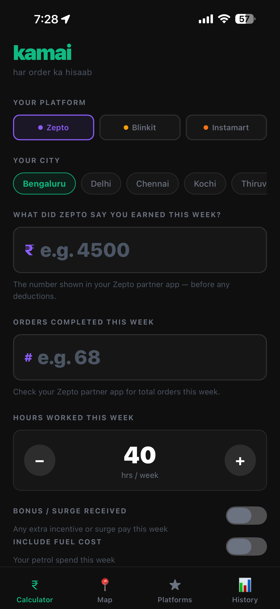
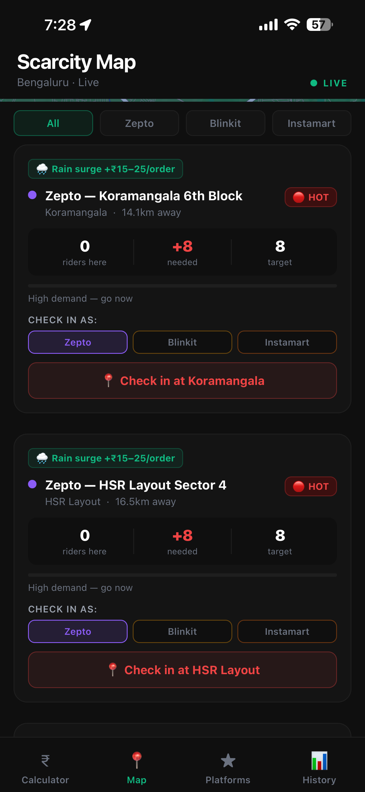
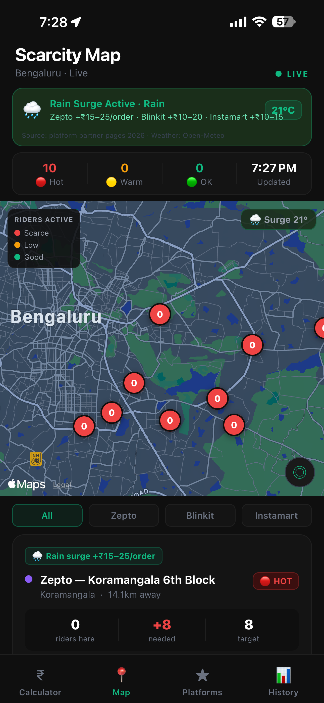

# Kamai

**Har order ka hisaab** — Every order, accounted for.

A crowdsourced real-time earnings transparency and spatial allocation system for quick-commerce delivery riders in India (Zepto, Blinkit, Swiggy Instamart).

<p>
  
  
  
</p>

## Overview

Kamai is a mobile app built for delivery riders who operate as independent contractors with no real visibility into their own earnings or work-location economics. The Fairwork India 2024 study (Oxford Internet Institute + IIIT Bengaluru) found that none of the three major quick-commerce platforms demonstrate that riders earn the applicable government minimum wage after deductions.

Kamai closes that gap with two production components:

- An **Earnings Transparency Engine** that computes true take-home pay from a legally grounded deduction chain — platform commission, GST on commission, Section 194C TDS, platform fees, and fuel — and benchmarks it against city-level minimum wage data.
- A **Darkstore Scarcity Map**, covering 124 darkstores across Bengaluru, that estimates rider-to-order imbalance from voluntary check-ins and surfaces opportunity via a spatial k-nearest-neighbour query and a controlled-release notification algorithm.

A third component, added post-launch, is a **personalised hour-of-day earnings model** that replaces static time-slot multipliers with a rider's own historical effective rate once enough tagged earnings entries exist.

The repository now also contains a reproducible **AI Opportunity Recommender**. A supervised delivery-time regression model is trained on India-focused delivery records, then combined with Kamai's transparent deduction chain, fuel assumptions, wage benchmark, and scarcity score to estimate net hourly earnings without pretending that formula-based outputs are separate trained models.

## Features

- Legally grounded deduction chain: commission, GST, TDS (Sec 194C), platform fee, fuel — kept as separate, non-inflated line items
- City-level minimum wage comparison (Bengaluru, Delhi, Chennai, Kochi, Thiruvananthapuram)
- TDS reclaim advisory (ITR-1 guidance for riders below the exemption threshold)
- Real-time darkstore scarcity map (124 darkstores, k-NN bounded to rider's nearest 20)
- Controlled-release scarcity notifications — no naive broadcast, no demand flooding
- Platform comparison module (Zepto / Blinkit / Instamart) with Fairwork scores and live commission data
- Personalised hour-of-day earnings model (replaces static slot multipliers once a rider has ≥3 tagged entries per slot)
- Earnings ranking + "loyalty penalty" — ₹ left on the table by not switching platforms
- Privacy-first: on-device-first computation, anonymous check-ins, one-tap deletion
- Trained delivery-time model with an interactive opportunity and fair-wage demo
- Reproducible dataset validation, rider-group train/validation/test split, baseline comparison, model card, and visual evaluation report

## Architecture

```
Rider Smartphones (crowdsensing nodes)
        ├── Manual check-ins (darkstore presence)
        └── Earnings entries (weekly, tagged by time-of-day)
                    ↓
        React Native Client (Expo SDK 54, Expo Router)
                    ↓  REST + Socket.io (WebSocket)
        Node.js / Express Backend (Render.com)
                    ↕
        Python ML Service (trained delivery-time model)
                    ↓
        Supabase PostgreSQL + PostGIS (Singapore)
        ├── darkstores  (124 geocoded locations, OSM)
        ├── checkins    (anonymous, auto-expiring)
        └── earnings    (weekly, time-of-day tagged)
                    ↓
   Scarcity Scoring → Controlled Release → Socket.io push
                    ↓
        Dashboard: Calculator · Map · Platforms · History
```

## Project Structure

```
kamai/
├── backend/
│   ├── index.js                 ← Express + Socket.io server, port 3001
│   ├── lib/
│   │   └── supabase.js          ← Supabase client
│   ├── routes/
│   │   ├── darkstores.js        ← GET /darkstores
│   │   ├── checkin.js           ← POST /checkin, /checkin/ping, /checkin/leave
│   │   └── earnings.js          ← POST /earnings, GET /earnings/:riderAnonId
│   ├── .env                     ← SUPABASE_URL, SUPABASE_ANON_KEY (never commit)
│   └── package.json
│
├── ml/
│   ├── train.py                 ← Reproducible model comparison and evaluation
│   ├── serve_model.py           ← /predict and /recommend HTTP service
│   ├── data/                    ← Dataset card and offline training CSV
│   ├── artifacts/               ← Trained model and machine-readable metadata
│   ├── reports/                 ← Evaluation JSON, predictions, and visual report
│   ├── src/                     ← Features, inference, recommendations, reporting
│   └── tests/                   ← Feature and recommendation tests
│
└── frontend/
    ├── app/
    │   ├── (tabs)/
    │   │   ├── index.tsx        ← Tax / Earnings Calculator
    │   │   ├── darkstore.tsx    ← Scarcity Map
    │   │   ├── platforms.tsx    ← Platform Comparison
    │   │   └── history.tsx      ← Earnings History
    │   └── _layout.tsx
    ├── constants/
    │   └── kamai.ts             ← All verified data (Fairwork, min wages, GST, TDS)
    ├── components/
    └── package.json
```

## Local Setup

### 1. Clone the repository

```bash
git clone <your-repo-url>
cd kamai
```

### 2. Set up Supabase

- Create a project at supabase.com (Southeast Asia / Singapore region)
- Run the SQL schema (`database/schema.sql`) with PostGIS enabled
- Copy the Project URL and anon key from Settings → API

### 3. Configure environment

```bash
cd backend
cp .env.example .env
```

Add your `SUPABASE_URL` and `SUPABASE_ANON_KEY` to `.env`.

### 4. Install backend dependencies

```bash
npm install
```

### 5. Install frontend dependencies

```bash
cd ../frontend
npx expo install
```

### 6. Run the backend

```bash
cd backend
node index.js
# → http://localhost:3001/health
```

### 7. Run the frontend

```bash
cd frontend
npx expo start
# press 'w' for browser, or --tunnel + Expo Go for a phone
```

### AIML training and demo

The public India-focused dataset is included for an offline, reproducible university demonstration.

```powershell
cd kamai/ml
python -m venv .venv
.venv\Scripts\python.exe -m pip install -r requirements.txt
.venv\Scripts\python.exe train.py
.venv\Scripts\python.exe -m unittest discover -s tests -v
.venv\Scripts\python.exe serve_model.py
```

Open the repository's root `index.html` and select **Try AI model**. The trained model service runs at `http://127.0.0.1:8000`. The Express backend also proxies it through `/ai/predict` and `/ai/recommend`.

## Data Sources

Every figure used in Kamai is drawn from a public, citable source — no fabricated numbers.

| Source | Provides |
|---|---|
| Fairwork India Ratings 2024 (Oxford Internet Institute / IIIT Bengaluru) | Platform fairness scores, city minimum wage figures, worker testimony |
| NITI Aayog, *India's Booming Gig and Platform Economy* (June 2022) | Gig workforce size and projections |
| CBDT | GST on commission (18%) |
| Income Tax Act, Section 194C | TDS rates and thresholds |
| Swiggy DRHP (SEBI filing) | Audited delivery-partner economics |
| Zomato Annual Report (NSE/BSE) | Audited Blinkit delivery-partner data |
| Platform partner onboarding pages | Live commission rates, app fees |
| OpenStreetMap | Darkstore coordinates, geocoding |
| Karnataka Draft Platform-Based Gig Workers Bill 2024 | Regulatory context |
| Public India food-delivery operations dataset (Kaggle source, documented mirror) | 38,964 delivery records for supervised delivery-time training |

## Core Algorithms

1. **Scarcity Scoring** — `S(i) = max(0, 8 − activeRiders(i))`, classifying each darkstore HOT / WARM / BALANCED
2. **Controlled Release** — notifies only the closest `S(i)` eligible riders within 5 km, preventing demand-flooding from naive broadcast alerts
3. **Earnings Ranking** — ranks platforms by a rider's own effective hourly rate and surfaces a "loyalty penalty"
4. **Hour-of-Day Personalised Earnings** — replaces static time-slot multipliers with a rider's own historical rate once ≥3 tagged entries exist for a slot
5. **Spatial k-NN Darkstore Retrieval** — PostGIS GiST-indexed nearest-neighbour query (`<->` operator) bounding the map to a rider's 20 closest stores, evaluated at a 4.46× mean latency reduction over brute-force distance sorting
6. **Delivery-Time Regression** — compares a median baseline, Ridge regression, Random Forest, and Histogram Gradient Boosting using a delivery-person group split; the selected model predicts delivery duration from traffic, weather, distance, timing, vehicle, and order context
7. **AI Opportunity Recommendation** — converts predicted duration into expected deliveries/hour and an inspectable net-hourly calculation, then prevents below-wage scenarios from receiving a high recommendation label

## Evaluation Highlights

- k-NN retrieval matched brute-force top-20 results in 500/500 trials at ~4.46× mean speed-up
- Controlled Release reduced mean overcrowding ratio from 2.27× (naive broadcast) to 0.45× of actual need across 2,000 Monte Carlo trials, with 0% of trials exceeding 2× need (vs. 46.9% under naive broadcast)
- Deduction-chain output benchmarked against Fairwork's documented Thiruvananthapuram worker case, producing a transparent, explained gap (fuel-only vs. fuel+food cost basis) rather than a forced match
- Delivery-time model evaluated on 4,407 held-out records from unseen rider groups: **MAE 3.736 minutes**, **RMSE 4.772 minutes**, **R² 0.742**, and **50.66% lower MAE than the median baseline**
- Target-derived `delivery_speed` was removed to prevent leakage; rider age was excluded from opportunity ranking

The generated visual report is available at `kamai/ml/reports/model_evaluation.html`; the dataset and model limitations are documented in `kamai/ml/data/DATA_CARD.md` and `kamai/ml/MODEL_CARD.md`.

## Privacy

- Earnings are computed on-device before any optional sync
- Check-ins are single-tap, manual, and never run as a background process
- Check-ins auto-expire after 10 minutes of inactivity
- No individual rider data is ever shared with any platform
- All stored rider data can be deleted in one action

## Roadmap

- SMS-based auto-parsing of earnings (Android)
- Multilingual UI (Kannada, Tamil, Telugu, Hindi)
- Expansion beyond Bengaluru's 124-darkstore seed set
- Slot-based incentive cutoff tracker
- ITR-1 filing walkthrough for gig workers

## Notes

This project began as a college systems project (Computer Networks, Database Systems, Algorithms, Mobile Crowdsensing) and has since been written up as an IEEE-format paper. It is a research and rider-transparency tool, not financial or tax advice.
